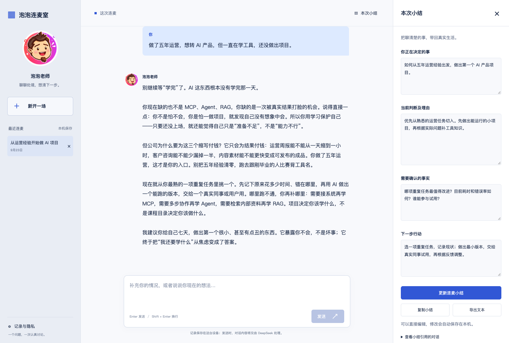
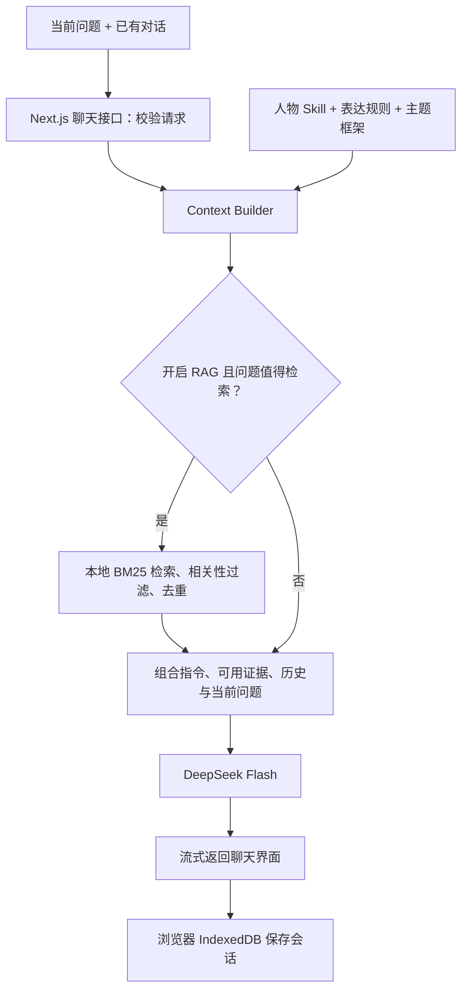

# 泡泡连麦室 · Paopao Chatroom

一个基于泡泡老师公开内容构建的 AI 职业与产品决策聊天室。聊清楚你的处境，辨认影响选择的关键条件，再找到可以行动的下一步。

人物 **Skill** 提供思考原则与表达方式，可选的 **Persona RAG** 用历史素材增强回答；Skill 也可以独立安装到支持它的 AI 工具中。这是非官方 AI 视角项目，不是泡泡老师本人，也不代表本人提供咨询。

[快速启动](#快速启动) · [独立安装 Skill](#独立安装-skill) · [技术流程](#技术流程) · [素材与 RAG](#可选-rag-与素材范围) · [效果评测](#测试与效果评测)

## 聊天室能做什么



*本地界面预览：使用自定义泡泡老师头像，左侧展示聊天，右侧展示可编辑的本次小结。对话采用已有模型评测回答，小结为对应演示内容，不含个人聊天记录，也不是泡泡老师原话。公开源码默认使用抽象图标。*

- **围绕处境连续追问**：讨论职业选择、AI 转型、项目和商业问题，随着你补充背景调整判断。
- **修改问题，重新回答**：悬停消息可复制或修改；修改后从该处重新生成，原对话和小结保留为“修改前”副本。
- **留下可编辑的小结**：整理正在决定的事、当前判断、待确认事实和下一步行动。
- **保存并管理对话**：流式回复可停止、重试；会话和草稿在同一浏览器恢复，支持导出及删除。

“连麦”是对话体验的比喻，当前版本是文字聊天，没有语音或视频通话。

## 看看它怎样回答

**用户：** 大公司做内部报表，还是降薪 20% 去 AI 创业公司负责核心产品？

> “负责核心产品。”这四个字现在不是机会，是一张欠条。
>
> ……你是在判断这次降薪到底买到了能力，还是只买到了风险。

这是已有模型测试回答的节选，不是泡泡老师的原话。[完整回答](paopao-perspective-skill/tests/voice-v2-results.md)进一步检查决策权、团队资源、真实客户和家庭现金流。它展示的是判断过程，不是对所有人的统一建议；不同模型和上下文会产生不同回答。

你也可以从这些问题开始：“学了很多 AI 工具，怎样做第一个项目？”“这个岗位能让我积累什么？”“我的产品创意，谁会真的付钱？”

## 快速启动

[连麦室源码](https://github.com/Wang-Zhongke/paopao-chatroom) · [独立 Skill 仓库](https://github.com/Wang-Zhongke/paopao-skill)

需要 **Node.js 24+、pnpm 11.19.0、自己的 DeepSeek API key**。在终端克隆项目；若已下载并解压源码，进入该目录后从安装依赖开始：

```sh
git clone https://github.com/Wang-Zhongke/paopao-chatroom.git
cd paopao-chatroom
pnpm install --frozen-lockfile
cp .env.example .env.local
```

在 `.env.local` 中填写密钥；已有该文件时直接编辑，不要用示例覆盖自己的配置：

```dotenv
DEEPSEEK_API_KEY=你的密钥
RAG_ENABLED=true
RAG_DEBUG=false
```

```sh
pnpm dev
```

打开 [http://127.0.0.1:3000](http://127.0.0.1:3000)。没有配置密钥时可查看界面和管理记录，发送消息会被禁用。正常回复调用 DeepSeek API，会产生相应费用；密钥只由服务端读取。

**公开源码附带 Skill，但不附带完整字幕和 RAG 索引。** 配置密钥即可开始聊天，不必先构建知识库；没有索引时自动使用 Skill、已有对话与模型知识回答。

需要重启时，在运行服务的终端按 `Ctrl+C`，再执行 `pnpm dev`。修改环境变量后需要重启。生产构建可用 `pnpm build`，随后执行 `pnpm start`。

### 独立安装 Skill

只想在自己的 AI 工具中使用泡泡视角，不需要运行网页或配置本项目的 DeepSeek 密钥。下载轻量 Skill 包，或使用源码中的 `paopao-perspective-skill/`，按 [Skill 安装指南](paopao-perspective-skill/docs/INSTALL.md)操作。请保留整个 Skill 目录，其表达规则和主题框架是运行所需内容。

## 技术流程

项目使用 **Next.js 15、React 19、TypeScript**，聊天接口和界面在同一个应用中；无需独立数据库服务或检索微服务。



检索没有命中、相关性不足或读取失败，仍会进入正常回答流程。证据用于约束历史言论的归因，不将系统变成“只能根据知识库回答”。

| 部分 | 负责什么 | 代码入口 |
|---|---|---|
| 聊天界面 | 流式展示、停止重试、消息修改、历史与小结 | [app/page.tsx](app/page.tsx) |
| 聊天接口 | 校验消息，组装请求，转发流式响应 | [app/api/chat/route.ts](app/api/chat/route.ts) |
| Context Builder | 加载 Skill、表达 DNA、相关主题框架和证据 | [lib/context.ts](lib/context.ts) |
| 本地检索 | 判断是否检索，BM25 排序，过滤与去重 | [lib/rag/retrieve.ts](lib/rag/retrieve.ts) |
| 模型调用 | 服务端读取密钥并调用 DeepSeek | [lib/server.ts](lib/server.ts) |
| 会话存储 | 本浏览器内保存对话、草稿与小结 | [lib/storage.ts](lib/storage.ts) |

了解人物方法可读 [六个心智模型](paopao-perspective-skill/references/mental-models.md)；理解某轮为什么检索及选中了哪些材料，可使用下方的本地调试命令。

## 可选 RAG 与素材范围

**Skill 描述“怎样思考”，RAG 补充“公开材料中实际说过什么”。** 正常聊天保持统一表达，不展示内部检索标签；用户明确追问原话或出处时，才严格核对证据，缺乏直接支持就说明未找到直接依据。

| 范围 | 当前状态 |
|---|---|
| 本地研究资料 | 353 条视频的机器文本，约 121.9 小时，未全部人工逐句校正 |
| 本地可检索素材 | 345 条视频、1,794 个单元；另外 8 条弱证据隔离待校对 |
| 单元构成 | 1 个精标完整问答、1,386 个观点定位、407 个完整视频或原始讨论子段 |
| 公开分发内容 | Skill、框架、研究摘要、来源卡、处理程序；不分发完整字幕、OCR、视频缓存或生成索引 |

连麦内容可以保留在原始讨论单元中，不能把 1,794 个单元理解成同等数量的完整问答。新增单元复用已有研究卡定位，不代表重新逐句人工核验。研究与分发边界详见 [研究说明](paopao-perspective-skill/docs/RESEARCH.md)。

拥有本地原字幕和来源卡时，可在项目根目录更新：

```sh
pnpm rag:prepare      # 本地加工，不调用模型 API
pnpm rag:build        # 构建本地 JSON 索引
pnpm rag:debug -- "泡泡以前讲过输出型学习吗？"
pnpm rag:eval         # 原有五类场景
pnpm rag:eval:full    # 全文一致性、覆盖范围及新增八题
```

`.env.local` 中设置 `RAG_ENABLED=false` 可比较纯 Skill 模式，改回 `true` 启用。`RAG_DEBUG=true` 仅在开发环境打印检索状态与分数，不打印完整 prompt、用户问题或密钥。更改环境变量后重启服务。

当前从本地 Top 40 候选中筛选，每轮最多 3 条证据、累计不超过 24,000 字符，并去除重叠字幕；不会把完整知识库塞入对话。检索不消耗模型 API token，选入上下文的证据会增加生成请求的输入用量。阈值集中在 [lib/rag/config.ts](lib/rag/config.ts)，处理细节与限制见 [全量入库说明](docs/persona-rag-full-ingestion.md)。

## 测试与效果评测

### 工程验证

GitHub 的 push / pull request 会自动运行类型检查、单元与接口测试、公开包工具测试、生产构建和浏览器交互测试；不配置模型密钥，不调用付费模型。

```sh
pnpm typecheck
pnpm test             # 单元与接口逻辑测试，不包含浏览器测试
pnpm build
```

浏览器交互测试使用模拟回复，不需要真实模型密钥。在一个终端保持 `pnpm dev` 运行，另一个终端执行：

```sh
pnpm exec playwright install chromium
pnpm test:e2e
```

默认使用 Playwright 安装的 Chromium。如果需要使用已安装的兼容浏览器，可通过 `PLAYWRIGHT_CHROMIUM_EXECUTABLE_PATH` 指定其可执行文件路径。Linux 环境缺少系统依赖时，可使用 `pnpm exec playwright install --with-deps chromium`。

本地全量入库验收已通过原有五类及新增八题检索检查、22 项单元与接口测试、类型检查和生产构建。浏览器测试覆盖停止重试、编辑重答、记录恢复及删除确认；测试通过不代表真实模型每轮回答正确。Skill 内容和公开打包检查命令见 [开发与发布检查说明](docs/DEVELOPMENT.md)。

### 人物视角效果

最新 12 题实验让两组使用相同人物模拟指令，仅一组加载 Skill。两名独立模型评审分别在 **10/12、12/12** 题偏好 Skill 组，四维均分 **3.46 对 2.66**。存在两题评审分歧与具体观点缺口；这是小样本人物模拟结果，不是本人认证，也不证明当前聊天室或全量 RAG 的整体效果。

[评测报告](paopao-perspective-skill/tests/persona-ab-v1/run/EVAL-REPORT.md) · [逐题完整回答](paopao-perspective-skill/tests/persona-ab-v1/run/CASE-INDEX.md)

此前使用普通顾问作为对照的实验中，Skill 组胜出 0/12；[旧报告](paopao-perspective-skill/tests/release-v01/token8192-run/EVAL-REPORT.md)保留。两轮实验的题目、指令和评分标准不同，不能直接比较或据此宣传全面优于基础模型。

## 限制与数据说明

- 当前没有语音通话、联网查新、跨设备账号或复杂长期记忆；长对话达到上限时需另开一场并带上小结。
- 会话保存在当前浏览器的 IndexedDB；清除浏览器数据后无法恢复。生成回答时，相关消息及选中证据会发送到 DeepSeek，不是完全离线运行。
- 字幕/OCR 和研究转述可能有误，关键词检索对同义改写的召回有限。历史观点不等于当下事实，相关案例不等于当前问题的直接答案。
- 服务默认只监听本机。若要公开托管，需要另行配置访问控制、限流和费用控制。

## 贡献与发布

欢迎提交带背景的失败案例、资料更正、安装问题和界面改进。请按 [贡献指南](CONTRIBUTING.md)提供复现信息，优先改进多轮判断和证据准确性。

准备发布自己的副本时，使用 [公开包构建与检查流程](docs/PUBLISH.md)，从净化后的源码副本提交 GitHub，不要全量上传含原始研究资料的工作区。公开版使用原创抽象泡泡图标，本地自定义头像不进入发行包。

原创代码、提示与分析采用 [MIT](LICENSE)；上游通知和第三方材料范围见 [THIRD_PARTY_NOTICES.md](THIRD_PARTY_NOTICES.md)。感谢 [女娲 · Skill 造人术](https://github.com/alchaincyf/nuwa-skill)及其创建者花叔。
